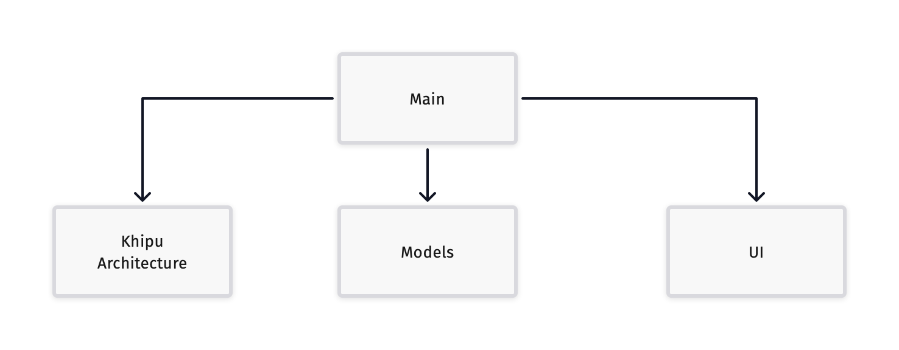
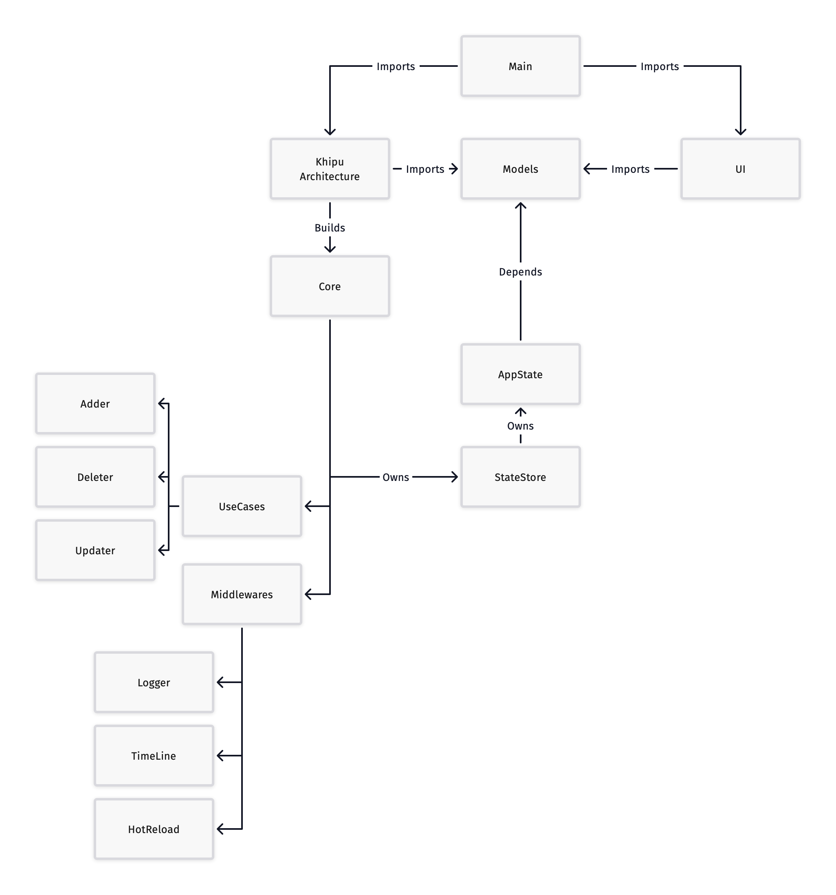

[Khipu Architecture](//vikingosegundo.gitlab.io) port of the Redux features described in the amazing [Redux architecture and mind-blowing features]( https://wojciechkulik.pl/ios/redux-architecture-and-mind-blowing-features) article by Wojciech Kulik.

## Timeline replay

https://user-images.githubusercontent.com/23734068/230791535-a02705eb-efe6-44f4-83da-fe7ee4b72f67.mp4

## Hot reload

Works with VSCode, but won't with the majority of editors:

> If you try to test this by opening a text editor, adding some text and saving the file, you'll see that it may not work. The reason is that editors like Xcode don't actually modify the file -- instead, they act on copies of it. When you save it, they delete the original file and replace it with the copy they were maintaining. —[SwiftRocks](https://swiftrocks.com/dispatchsource-detecting-changes-in-files-and-folders-in-swift)

https://user-images.githubusercontent.com/23734068/230792329-399aa2fb-71bb-4ff9-a1aa-3c03e3a6292b.mov

### Modular architecture

### Dependency diagram

(A bit messy but I did my best)

