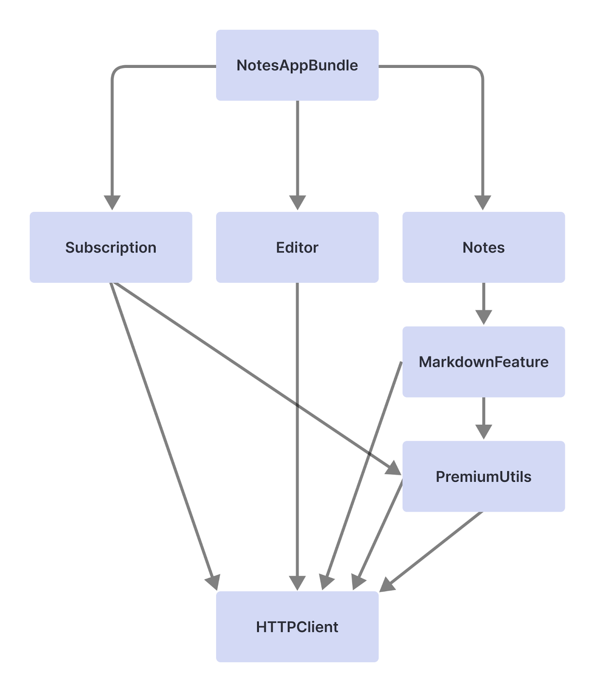
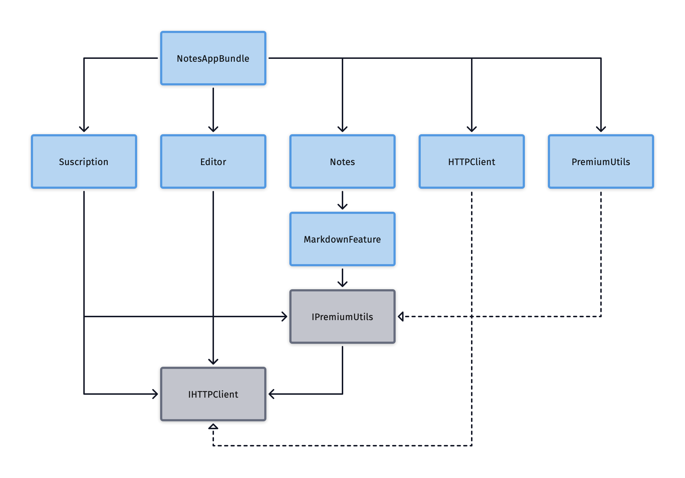

Practice project for integrating and learning the principles exposed on the [modularization article from Bruno Rocha](https://www.runway.team/blog/how-to-improve-ios-build-times-with-modularization)

The second commit contains the implementation of the dependency graph showcased at the beginning of the article:

As described by the article, this scales badly as on each change of the HTTPClient, a recompile is needed for all the modules that use it.

Instead:

- We made those modules depend on a protocol
- We create a separate module for the concrete implementation
- The main module imports everything, assembles the modules and injects the concrete implementation.

A protocol isn't likely to change much during our dev (susceptible to change mostly at the beginning but rarely later)

If the HTTPClient implementation module changes, any module that depends on the HTTPClientProtocol will not be recompiled, thus, keeping compiling times fast.

The dependencies become horizontal, here's an updated dependency diagram:

Third commit partially implements this (for simplicity I only HTTPClient a protocol)