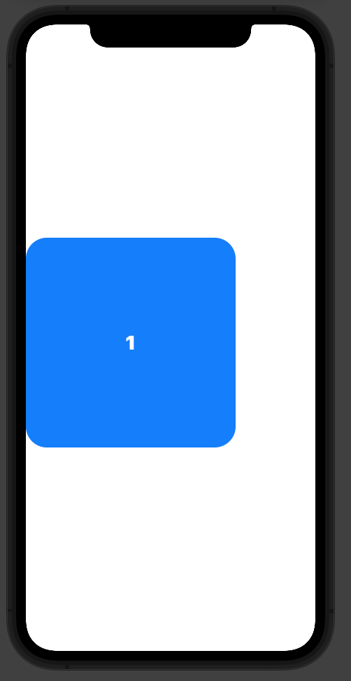
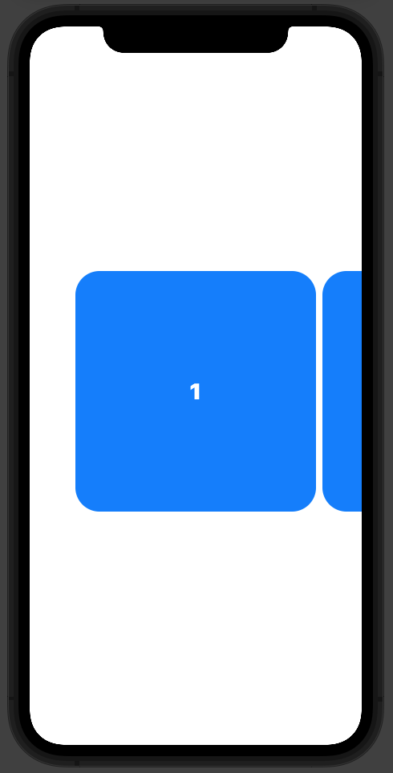
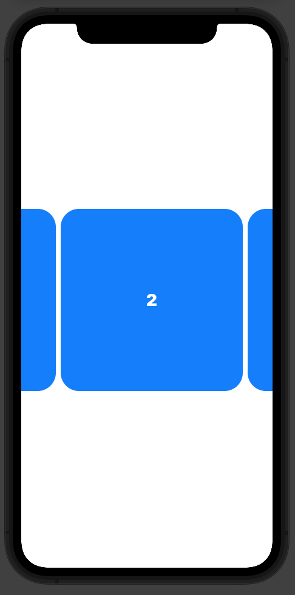

# Cómo crear un carousel con DragGesture en SwiftUI
#review/dev/swift/swiftui

El componente `ScrollView` es muy limitado en cuanto a personalización.

Por ello muchas de las soluciones de otros desarrolladores que se encuentran buscando en google utilizan como base un `HStack`.

En varios proyectos me sirvieron para implementar la funcionalidad, hasta que me topé con un caso particular que ninguna de las soluciones existentes resuelve (al menos, ninguna de las que encontré):

Para un carousel con, por ejemplo, cuatro elementos, presentamos el carousel enfocado en el primer elemento y el usuario puede navegar entre ellos deslizando el dedo.

Pero, ¿y si quisiéramos mostrar el carousel enfocado en segundo elemento desde el principio? ¿O el tercero? ¿O cualquier otro elemento que no sea el primero? 

Ninguna de las implementaciones que encontré preveé esa funcionalidad.

No si sentirme agradecido por ello, porque tuve que el trabajo sucio y el asunto fue tan satisfactorio como frustrante.

### Principios y geometría

Un `HStack` centra su contenido por defecto (a menos que le digamos lo contrario).

Si en vez de un item metemos cuatro, el contenido desborda de la pantalla, pero aún así está centrado.:

Usaremos estos cuatro elementos como referencia para el tutorial.

Para implementar el carousel, el principio será el siguiente:

* Centraremos el carousel en el primer elemento empujándolo hacia la derecha
* Si queremos centrar el carousel en uno de los elementos sucesivos tendremos que tirar de todo el contenido hacia la izquierda

### Centrando el primer elemento

Vamos a empezar descomponiendo la tarea en pedacitos:

1. En un principio nos conformaremos con que el primer elemento aparezca en la pantalla, pegado al borde izquierdo.
2. Luego centraremos el elemento, empujándolo a la distancia necesaria para centrarlo.

#### Pegar al borde el primer elemento

Para hacer que el primero elemento se pegue a la pantalla, primero veamos qué es lo que tenemos por el momento:

Vamos a llamar las partes que desbordan por el término inglés: *overflow*.

Viendo la imagen queda claro que para pegar el primer cuadrado al borde tenemos que empujar todo el contenido hacia la derecha a una distancia correspondiente al overflow dividido por dos.

> Overflow = (Ancho total del contenido - Ancho de la pantalla) / 2  
> 

Conocemos el ancho de la pantalla -\> `UIScreen.main.bounds.size.width`

Tenemos que calcular el ancho total del contenido:

> Ancho tot. contenido = ∑ (Ancho item) + ∑ (Ancho espacio)  
> ∑ (Ancho item) = N° items \* Ancho de un item  
> ∑ (Ancho espacio) = N° de espacios \* Ancho del espacio entre cada item  
> N° de espacios = N° items - 1  
> 

Al empujar el cuadrado nos queda:

#### Centrar el primer elemento

Con el elemento pegado al borde podemos ahora empujarlo para centrarlo.

> Espacio blanco = Ancho de la pantalla - Ancho del item  
> 

Para centrarlo tendremos que empujarlo a una distancia igual a (Espacio blanco) ÷ 2.

Por lo tanto:

> Distancia de empuje = Overflow + (Espacio blanco) ÷ 2  

### Centrar arbitrariamente en un elemento

Si quisiéramos centrar el elemento número dos, tendríamos que empujarlo hacia atrás, es decir: tirar de él.

Para ello tendríamos que restarle la cantidad adecuada a la distancia de empuje que calculamos antes.

> Ancho real del item = Ancho del item + Ancho del espacio  
> Índice del item = Número del item - 1  
> Distancia a restar = Índice del item \* Ancho real del item  

#review